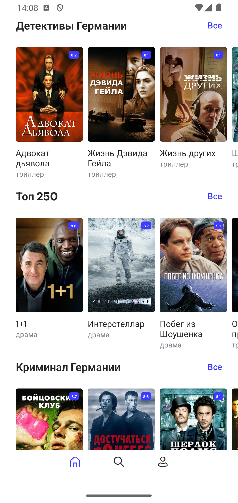
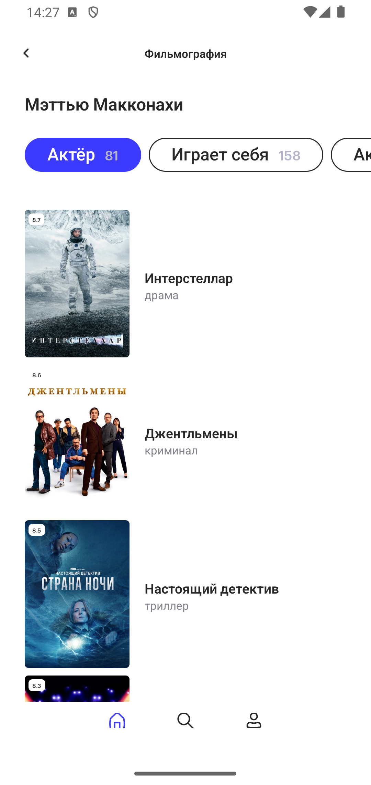

# SkillCinema  

🇷🇺 Русский

## О проекте  
Мобильное приложение для поиска фильмов и сериалов с использованием Kinopoisk API unofficial.  

### Возможности  
- Просмотр популярных фильмов, премьер, топ-250  
- Поиск по жанрам, странам и рейтингу  
- Сохранение в коллекции  
- Отметка просмотренных фильмов  
- Информация об актёрах и съёмочной группе  

## Технологии  
- **Язык**: Kotlin  
- **Архитектура**: Clean Architecture + MVVM  
- **API**: Kinopoisk Unofficial API https://kinopoiskapiunofficial.tech/
- **Локальная БД**: Room  
- **UI**: XML  

## Скриншоты  

  
  
  

 
🇬🇧 English

  
## About
A mobile app for searching movies and TV shows using Kinopoisk API unofficial.

### Features
- Browse popular movies, premieres, top-250
- Search by genre, country, and rating
- Save to collections
- Mark watched movies
- Actor and crew details

## Tech Stack
- **Language**: Kotlin
- **Architecture**: Clean Architecture + MVVM
- **API**: Kinopoisk Unofficial API https://kinopoiskapiunofficial.tech/
- **Local DB**: Room
- **UI**: XML
